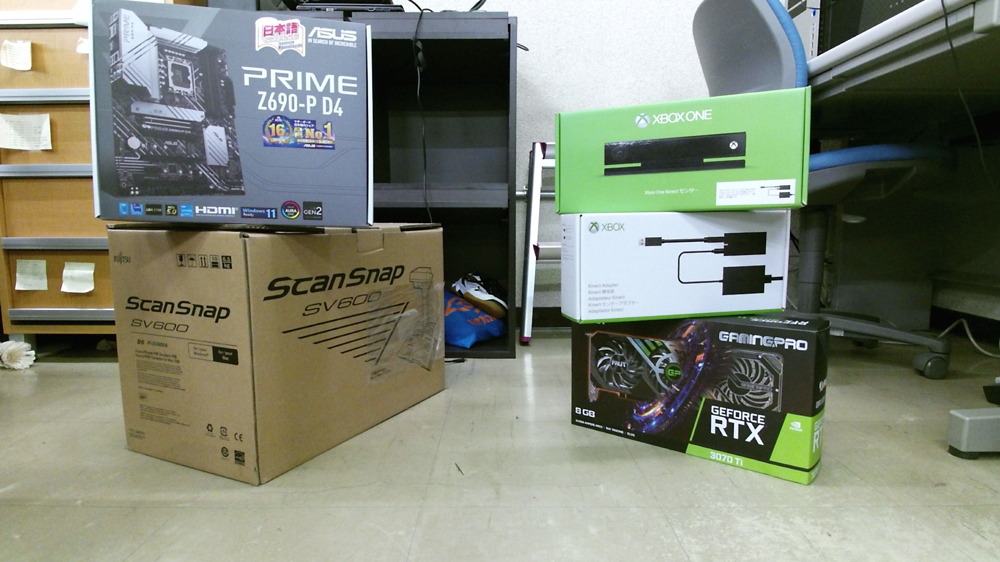
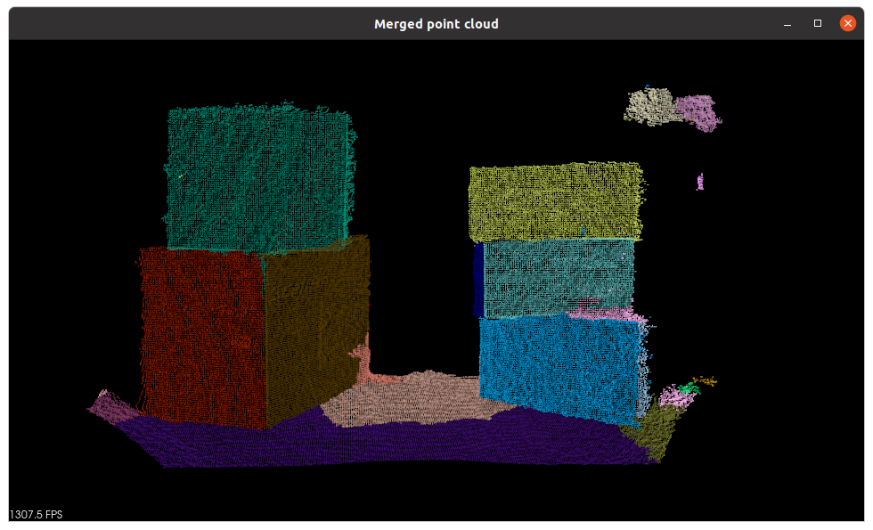
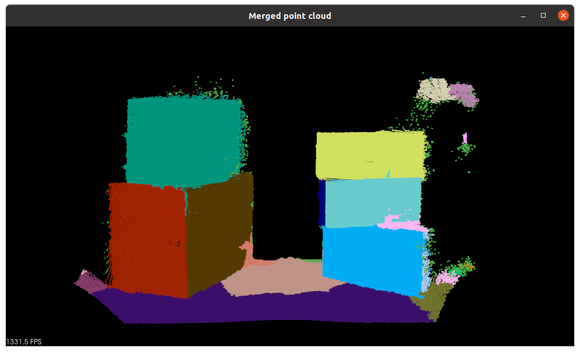
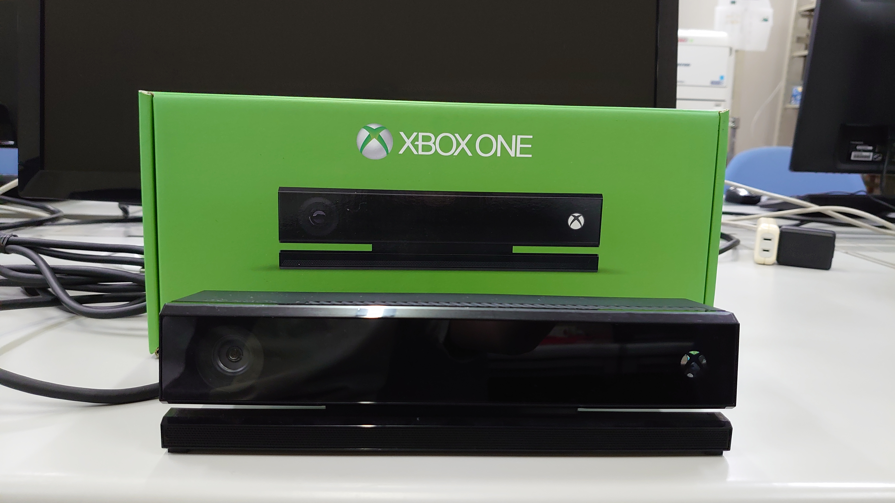
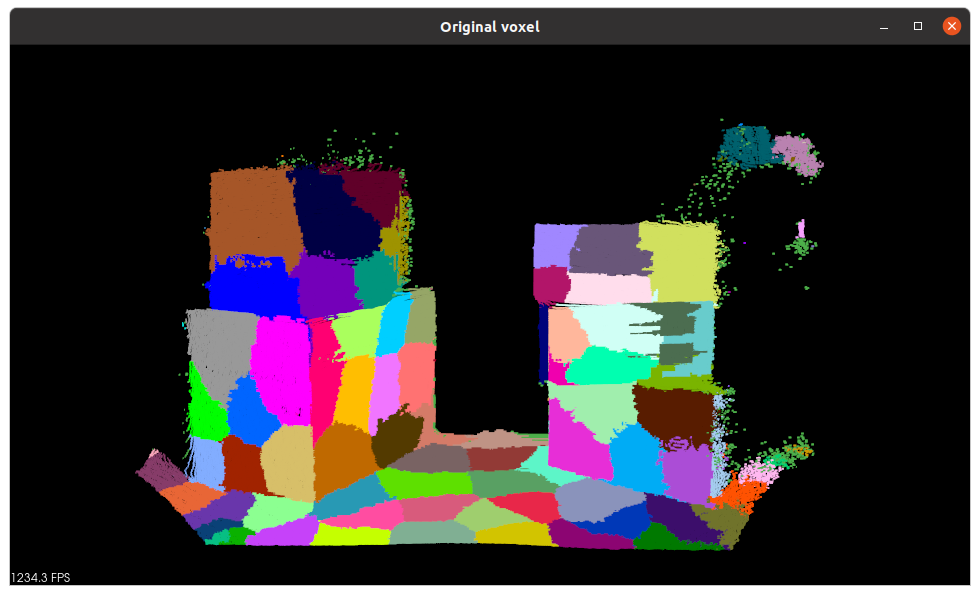
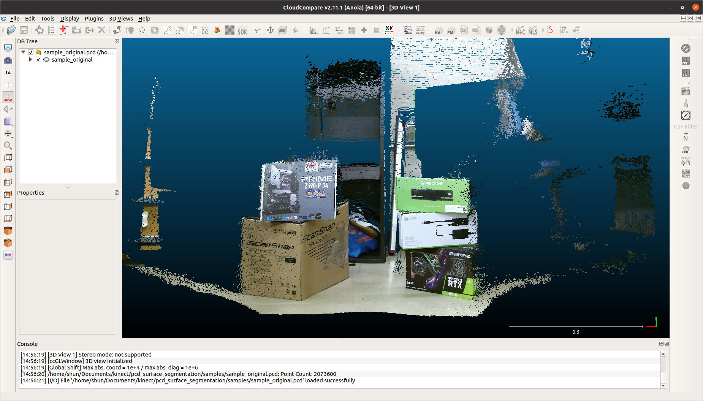

# Plane segmentation from supervoxel
Plane segmentation from  *Supervoxel Clustering* in Point Cloud Library.
A simple "Region Merge" algorithm using normal and centroid of regions detects planes from roughly labeled pcd created by *Supervoxel Clustering*. This is a very simple approach with robust performance and can be applied to areas such as ROS.

## Environment

* Ubuntu 20.04 LTS
* Opencv 4.5.2
* PCL 1.10.0
* Libfreenect2 (Optional)

## Build & How to use

### Clone & CMake

```
git clone https://github.com/shun74/plane-segmentation-from-supervoxel.git
cd plane-segmentation-from-supervoxel
mkdir build
cd build
cmake ../src
make
```

### Run
With RGB+D images. ( .png & 16bit .raw)
```
./main RGB_image_path Depth_image_path Configuration_file_path
```

With 3D data. ( .pcd)
```
./main PCD_data_path Configuration_file_path
```

**Note**

Running this program requires configuration file. (Some samples in /configs.) Check the samples to see what parameters are available. An explanation is written for each parameter. Also, all the parameters listed in the samples are required. To change data type, change the PCD_DATA flag in the .conf file like as follows.

- When running with a set of 2d images. (RGB+D)
```
PCD_DATA = false
```
- When running with a PCD data.
```
PCD_DATA = true
```

## Working Sample

One sample in "/samples" so you can test with it.

**Sample image**


### Running

```
./main ../samples/sample_color.png ../samples/sample_depth.raw ../configs/2d_image_sample.conf
```
or
```
./main ../samples/sample_original.pcd ../configs/3d_sample.conf
```

### Results
**USE_REDUCED_PCD = true** (To cut down computational costs.)

**USE_REDUCED_PCD = false**


## Supplementary Material
### What is Kinect ?

*Kinect V2* is an RGB+D sensor released by Microsoft in 2013. The original *Kinect V1* had a RGB resolution of 640 * 480, while the V2 has a full HD resolution of 1920 * 1080. The Depth sensor also has a resolution of 512 * 424 and can measure a range of 0.5m~4.5m. Recently, a smaller version with higher performance called *Azure Kinect* has been released. (Let's not mention that Kinect was a sensor for Xbox games.)

**Kinect V2**


### What is Supervoxel Clustering ?
Supervoxel Clustering is an algorithm that divide the Point Cloud into small clusters. Similarity of color, coordinates, and normal of each points in the point cloud are used for integration.

Please see the official tutorial for more detail. ->
[PCL Official Tutorial](https://pcl.readthedocs.io/projects/tutorials/en/latest/supervoxel_clustering.html)

*After sueprvoxel clustering*


Our "Region Merge" algorithm based on this supervoxel clusters. So the accuracy of this cluster is very important. If you apply better parameters for the situation, our algorithm will performe quite robust.


### Get data from Kinect V2

Let's get a data from Kinect V2. A sample Python program can be found in ./samples.

Befor running this program, you need to install *libfreenect2*. This is a driver package for Kinect V2, which makes it easy to get Kinect V2 data in C ++ ,Python and so on. [libfreenct2 GitHub](https://github.com/OpenKinect/libfreenect2)

**Instllation**

Install basic packages.
```
sudo apt install build-essential cmake pkg-config
sudo apt install libusb-1.0-0-dev libturbojpeg0-dev libglfw3-dev beignet-dev libopenni2-dev
```
Install libfreenect2.
```
git clone https://github.com/OpenKinect/libfreenect2.git
cd libfreenect2
mkdir build && cd build
cmake .. -DCMAKE_INSTALL_PREFIX=$HOME/freenect2
make
make install
```
Install python wrapper.
```
export PKG_CONFIG_PATH=$HOME/freenect2/lib
pip install --user freenect2
```
Set variable to .bashrc.
```
sudo nano ~/.bashrc
```
Then, add this line to the .bashrc.
```
export LD_LIBRARY_PATH="$LD_LIBRARY_PATH:${HOME}/freenect2/lib"
```
restart your terminal to reload .bashrc. You have now installed libfreenect2.

**Get one sample from Kinect V2**

Just run Python script in ./sample. To make sure your Kinect V2 connected to USB 3.0.
```
python get_data.py
```
Color image data, distance image 16-bit raw data, and point cloud data are automatically saved. Kinect V2 camera calibration data is also recorded in .txt. This is a parameter to set when performing 2D execution. See ./configs/2d_image_sample.conf for details.

You can visualize Point Cloud with *Cloud Compare*.

**original.pcd**

